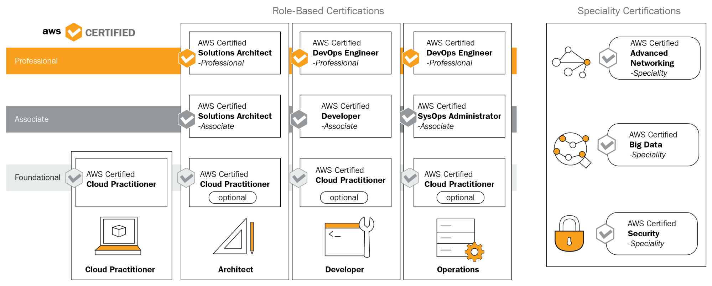

# Types of certifications

AWS mainly provides 4 differents of certifications:
 - cloud practitioner
 - Architect
 - Developer
 - Operations

AWS cloud practitioner is a foundational course for the architect, developer and operations roles.  The foundation course is the same for every role-based certification path. The CDA certification falls under the developer role. The cloud practitioner role is not mandatory for the associate level certifications.

After passing aws certified solutions architect associate exam you can take the ceritified solutions architect professional exam. Similarly after passing aws certified developer exam you can take the aws professional devops exam. Similarly the professional devops exam can be taken after the sysops associate exam.  The professional level certifications for sysops and developer remain the same. Aws also offers specialty exams in advancednetworking, big data and security. 

To prepare for the exams amazon provides a blueprint with the scope and required knowledge to write the exams. The exam scope will be divided by weight in sections.